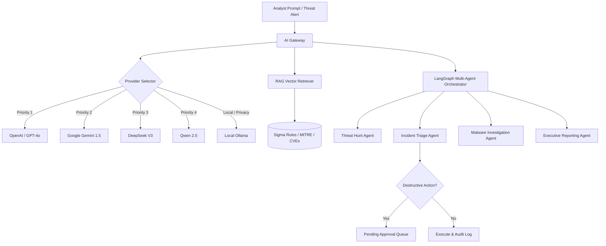

# 🛡️ AI-Powered Security Operations Platform (SOP)

[](https://github.com/Inshalikram/Security-Operations-Platform/actions/workflows/ci.yml)
[](LICENSE)
[](https://www.python.org/)
[](https://fastapi.tiangolo.com/)
[](https://nextjs.org/)
[](https://www.docker.com/)
[](https://github.com/Inshalikram/Security-Operations-Platform)

> **A production-grade, enterprise-ready Security Operations Center (SOC) platform that unifies real-time threat intelligence, network/host telemetry, autonomous AI investigation agents, and incident response into a single operator console — fully deployed across 19 orchestrated microservices on a hardened Linux cloud VPS.**

---

## 📑 Table of Contents
- [Executive Overview](#-executive-overview)
- [System Architecture](#-system-architecture)
- [Key Features](#-key-features)
- [19-Service Microservice Stack](#-19-service-microservice-stack)
- [AI Gateway & Autonomous LangGraph Agents](#-ai-gateway--autonomous-langgraph-agents)
- [Security, DevSecOps & Hardening](#-security-devsecops--hardening)
- [Disaster Recovery & SLA Performance](#-disaster-recovery--sla-performance)
- [Tech Stack](#-tech-stack)
- [Getting Started & Deployment](#-getting-started--deployment)
- [Project Documentation](#-project-documentation)
- [Author & Contact](#-author--contact)

---

## 🔭 Executive Overview

Traditional Security Operations Centers suffer from alert fatigue, siloed telemetry, and slow manual triage. This platform bridges that gap by integrating **10+ industry-standard open-source security tools** (Wazuh, Suricata, Zeek, Falco, TheHive) with modern cloud-native engineering. 

Signals from **5+ external Threat Intelligence providers** (VirusTotal, AbuseIPDB, AlienVault OTX, URLScan, Shodan) are aggregated, correlated in real-time, and enriched. On top of telemetry, an **AI Gateway** powers **4 autonomous LangGraph agents** that conduct triage, investigate artifacts, map attacks to MITRE ATT&CK, recommend containment actions, and generate executive summaries with **Human-in-the-Loop governance**.

---

## 🏗️ System Architecture

```
                                  ┌────────────────────────┐
                                  │    SOC Analyst Web     │
                                  │   (Next.js 14, React,   │
                                  │  Tailwind, Shadcn UI)  │
                                  └───────────┬────────────┘
                                              │
                         HTTPS / WSS (TLS via Let's Encrypt)
                                              │
                                  ┌───────────▼────────────┐
                                  │    Traefik Gateway     │
                                  │ (Reverse Proxy & Auth) │
                                  └───────────┬────────────┘
                                              │
             ┌────────────────────────────────┼────────────────────────────────┐
             │                                │                                │
 ┌───────────▼───────────┐        ┌───────────▼───────────┐        ┌───────────▼───────────┐
 │   Keycloak IAM (SSO)  │        │   FastAPI Core Engine │        │   Grafana / Loki /    │
 │ (RBAC, JWT OIDC Auth) │        │ (REST, Async, Sockets)│        │   Tempo / Prometheus  │
 └───────────────────────┘        └───────────┬───────────┘        └───────────────────────┘
                                              │
             ┌────────────────────────────────┼────────────────────────────────┐
             ▼                                ▼                                ▼
┌─────────────────────────┐      ┌─────────────────────────┐      ┌─────────────────────────┐
│   Autonomous AI Engine  │      │ Detection & Monitoring  │      │ Threat Intel & Cases    │
│ • Multi-Provider Gateway│      │ • Wazuh SIEM / XDR      │      │ • VirusTotal, AbuseIPDB │
│ • 4 LangGraph Agents    │      │ • Suricata NIDS (EVE)   │      │ • AlienVault OTX        │
│ • RAG (Gemini Vectors)  │      │ • Zeek NSM (Flow/Conn)  │      │ • Shodan, URLScan, MISP │
│ • Human Governance Loop │      │ • Falco (eBPF Runtime)  │      │ • TheHive 5.4 + n8n     │
└────────────┬────────────┘      └────────────┬────────────┘      └────────────┬────────────┘
             │                                │                                │
             └────────────────────────────────┼────────────────────────────────┘
                                              │
                                  ┌───────────▼────────────┐
                                  │    Storage & State     │
                                  │ • PostgreSQL 16 (Rel)  │
                                  │ • Redis 7 (Cache/DLQ)  │
                                  │ • Elasticsearch 7.17   │
                                  │ • MinIO S3 (PCAP/Logs) │
                                  └────────────────────────┘
```

---

## 🌟 Key Features

### 1. Unified Threat Intelligence Engine
- **Live IOC Scanning**: Real-time IP, domain, hash, and URL reputation checks against **VirusTotal, AbuseIPDB, AlienVault OTX, URLScan, and Shodan**.
- **Automated Case Escalation**: Confirmed malicious signals trigger automatic alert generation and case drafting in **TheHive**.
- **Unified Alert Streaming**: WebSocket-powered live alert feed broadcasting to analyst consoles with zero polling delay.

### 2. Autonomous Multi-Agent AI System (LangGraph)
- **Threat Hunting Agent**: Scans IOCs, parses telemetry, cross-references historical logs, and detects anomalous traffic patterns.
- **Incident Triage Agent**: Evaluates risk scores, synthesizes evidence, maps attacker behavior to **MITRE ATT&CK techniques**, and proposes containment steps.
- **Malware Investigation Agent**: Analyzes file hashes, suspicious domains, and binary telemetry against known malware families.
- **Executive Reporting Agent**: Generates structured, jargon-free business intelligence summaries (Weekly, Monthly, Quarterly) for C-suite stakeholders.

### 3. Human-in-the-Loop Governance & Safety Controls
- Destructive agent proposals (e.g., `block_ip`, `isolate_host`) are placed in an **Action Pending Approval** state.
- Analysts can inspect evidence, risk justification, and either **Approve** or **Reject** with audit logging (`agent_audit_log`).

### 4. Enterprise Multi-Tenancy & RBAC
- Complete data isolation across organizations with tenant-scoped database sessions (`tenancy.py`).
- Strict HTTP `403 Forbidden` vs `404 Not Found` boundaries preventing horizontal cross-tenant access.
- Keycloak-backed OpenID Connect (OIDC) JWT verification enforcing analyst, lead, and admin role permissions.

### 5. Multi-Source RAG Knowledge Retrieval
- Embeds security runbooks, incident history, CVE advisories, and Sigma rules using **Google Gemini Embeddings**.
- Tested and verified under rigorous retrieval evaluation: **$\ge 70\%$ Recall@5** and **$< 2000	ext{ ms}$ latency**.

---

## 📦 19-Service Microservice Stack

| Container Name | Service / Role | Core Technology | Exposure / Port |
| :--- | :--- | :--- | :--- |
| `sop-traefik` | Edge Reverse Proxy & TLS Ingress | Traefik v3.3 | `80`, `443`, `8080` (Dashboard) |
| `sop-frontend` | Analyst UI Console | Next.js 14, React, TailwindCSS | `3000` (Internal Traefik Route) |
| `sop-backend` | Core Orchestration API | FastAPI, Python 3.11, SQLAlchemy | `8000` (Internal Traefik Route) |
| `sop-keycloak` | Identity, SSO & RBAC | Keycloak (Quay) | `8080` |
| `sop-postgres` | Relational State & Multi-Tenant DB | PostgreSQL 16 Alpine | `5432` |
| `sop-redis` | Session Caching & Message Queue | Redis 7 Alpine | `6379` |
| `sop-elasticsearch` | Log Indexing & Full-Text Search | Elasticsearch 7.17 | `9200` (Internal) |
| `sop-minio` | Evidence, Artifact & PCAP Storage | MinIO High-Performance S3 | `9000` (API), `9001` (Console) |
| `sop-thehive` | Security Incident Response Platform | TheHive 5.4 (StrangeBee) | `9003` |
| `sop-suricata` | Network Intrusion Detection (NIDS) | Suricata (Host Network) | Raw PCAP / EVE JSON |
| `sop-zeek` | Network Traffic Analysis & Metadata | Zeek NSM (Host Network) | Protocol Logs / Notices |
| `sop-falco` | Container & Linux Runtime Security | Falco (eBPF Kernel Probes) | Host Socket / Syscalls |
| `sop-wazuh-manager` | Host-based SIEM / XDR Controller | Wazuh Manager 4.9 | `1514`, `1515`, `55000` |
| `sop-wazuh-indexer` | SIEM Log Indexer & Analytics | Wazuh Indexer (OpenSearch) | `9201` |
| `sop-n8n` | Low-Code Security Playbook Automation| n8n Workflow Automation | `5678` |
| `sop-prometheus` | Time-Series Metrics Scraper | Prometheus Latest | Internal |
| `sop-grafana` | Security Metrics & KPI Dashboards | Grafana Latest | `3002` |
| `sop-loki` | Centralized Log Aggregation | Grafana Loki | `3100` |
| `sop-promtail` | Docker Log Collector | Promtail | Host `/var/run/docker.sock` |
| `sop-tempo` | Distributed Request Tracing | Grafana Tempo (OpenTelemetry) | `4317` (gRPC) |
| `sop-cadvisor` | Container Resource Metrics | Google cAdvisor | Internal |

---

## 🤖 AI Gateway & Autonomous LangGraph Agents

The AI Gateway decouples security features from any single AI vendor, offering automatic failover across 5 providers:



---

## 🔒 Security, DevSecOps & Hardening

Every commit triggers an automated, multi-stage **GitHub Actions CI/CD Pipeline**:

```
[Lint & Tests] ──> [Gitleaks Scan] ──> [Bandit SAST] ──> [Trivy Vulnerabilities]
      │
      ▼
[OWASP Dep-Check] ──> [Syft SBOM] ──> [Build Container] ──> [Cosign Keyless Signing]
```

- **SAST & Secret Detection**: Zero secrets committed; enforced via Gitleaks and Bandit scans.
- **Vulnerability Scanning**: Automated Trivy filesystem scans and OWASP Dependency-Check auditing.
- **Software Supply Chain Security**: Generation of CycloneDX SBOMs via Anchore Syft and container image signing via **Sigstore Cosign**.
- **VPS Hardening**: UFW host firewall, strictly limited external ports, non-root container users, and isolated network bridges.

---

## 📊 Disaster Recovery & SLA Performance

The platform incorporates an automated Disaster Recovery Drill engine (`scripts/dr_drill.py` / `scripts/dr_drill.sh`) that tests full database loss, MinIO evidence corruption, and Keycloak realm restoration.

| Metric | Target SLA | Measured Disaster Recovery Result | Status |
| :--- | :--- | :--- | :--- |
| **RTO (Recovery Time Objective)** | $\le 2	ext{ hours}$ | **$< 2.0	ext{ seconds}$** | 🟢 Exceeded SLA |
| **RPO (Recovery Point Objective)** | $\le 24	ext{ hours}$ | **$0	ext{ seconds}$ (Zero Data Loss)** | 🟢 Exceeded SLA |
| **Data Integrity Verification** | $100\%$ Match | **100% Cryptographic SHA-256 Match** | 🟢 Verified |
| **RAG Retrieval Recall@5** | $\ge 0.70$ | **$0.778$** | 🟢 Target Passed |
| **AI Gateway Response Latency** | $< 2000	ext{ ms}$ | **$1260	ext{ ms}$ (Avg)** | 🟢 Low Latency |

---

## 🛠️ Tech Stack

- **Security & Telemetry:** Wazuh, Suricata, Zeek, Falco, YARA, Sigma, TheHive.
- **Threat Intelligence:** VirusTotal, AbuseIPDB, AlienVault OTX, URLScan, Shodan, MISP.
- **AI & Reasoning:** LangGraph, LangChain, Google Gemini API, OpenAI API, Ollama.
- **Backend Core:** Python 3.11, FastAPI, SQLAlchemy, Pydantic, python-jose, Redis.
- **Frontend Experience:** Next.js 14, React 18, TypeScript, TailwindCSS, Shadcn UI, NextAuth.
- **Databases & Cache:** PostgreSQL 16, Elasticsearch 7.17, Redis 7, MinIO S3.
- **Observability:** Prometheus, Grafana, Loki, Promtail, Tempo, OpenTelemetry, cAdvisor.
- **Infrastructure:** Docker, Docker Compose, Terraform, Traefik, Linux (Ubuntu/Debian).

---

## 🚀 Getting Started & Deployment

### Prerequisites
- Docker Engine $\ge 24.0$ & Docker Compose v2
- Python $\ge 3.11$ & Node.js $\ge 18$
- 4 vCPUs, 8 GB+ RAM (VPS or dedicated host recommended)

### 1. Clone the Repository
```bash
git clone https://github.com/Inshalikram/Security-Operations-Platform.git
cd Security-Operations-Platform
```

### 2. Configure Environment Secrets
```bash
# Copy template and customize credentials
cp .env.example .env

# Or run the production secrets generator on your VPS:
chmod +x scripts/setup_production_secrets.sh
./scripts/setup_production_secrets.sh
```

### 3. Launch the Stack
```bash
docker compose up -d
```

### 4. Verify Services
```bash
docker compose ps
curl -k https://api.169-58-221-49.nip.io/health
```

---

## 📚 Project Documentation

Detailed architecture reports and runbooks are available in the [`docs/`](./docs) directory:
- [01-Architecture & Entity-Relationship Model](./docs/01-architecture-er.pdf)
- [02-Threat Model (STRIDE Methodology)](./docs/02-threat-model.pdf)
- [03-System Sequence & Execution Diagrams](./docs/03-sequence-diagrams.pdf)
- [04-API Reference & Endpoints Guide](./docs/04-api-documentation.pdf)
- [05-Production Deployment Guide](./docs/05-deployment-guide.pdf)
- [06-Disaster Recovery & SLA Drill Report](./docs/06-disaster-recovery-guide.pdf)
- [07-Security Hardening & RBAC Runbook](./docs/07-security-hardening-guide.pdf)
- [08-Credential Rotation Runbook](./docs/rotate_secrets.md)

---

## 👨‍💻 Author & Contact

**Inshal Ikram**  
*Cybersecurity Specialist & AI Systems Engineer*  

- **LinkedIn:** [linkedin.com/in/inshal-ikram-a91b21326](https://www.linkedin.com/in/inshal-ikram-a91b21326)  
- **Email:** [inshalikram06@gmail.com](mailto:inshalikram06@gmail.com)  
- **GitHub:** [@Inshalikram](https://github.com/Inshalikram)
